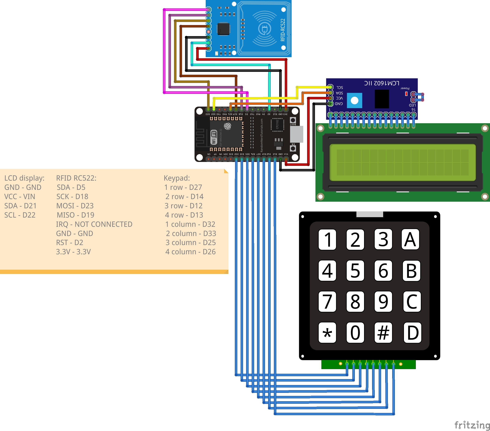

# Payment terminal

---

Model of payment terminal created for project EcoReceipt.
Terminal have two modes: working and setup.
In setup mode you can set company token, which will be saved.
In working mode there is a welcome text and then you can set cost of operation.
Terminal will wait for the card and after card terminal will send request on the server endpoint.

## Connection to esp32 doit devkit v1

